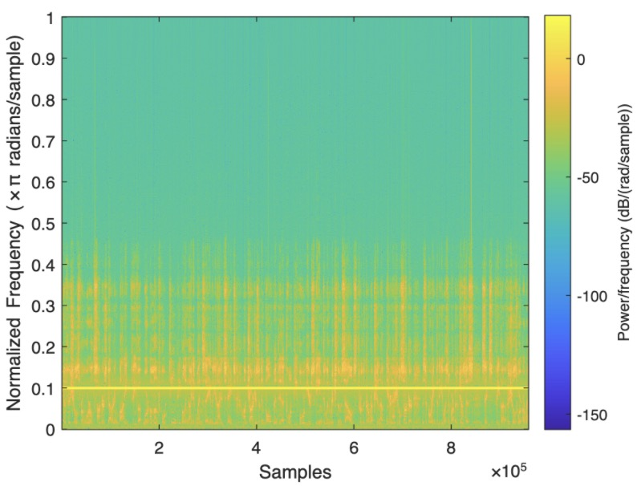
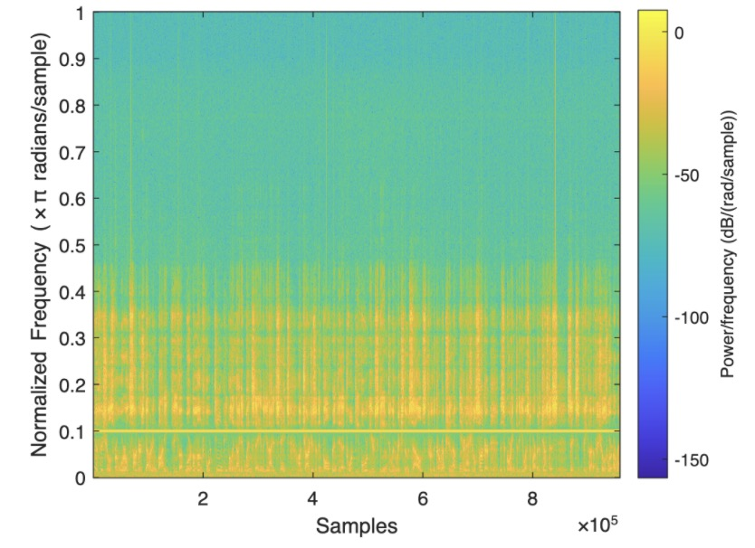
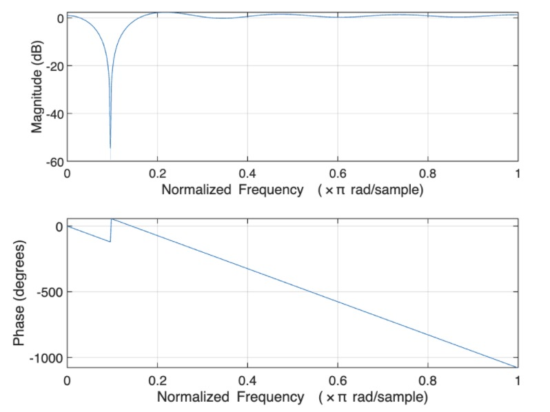
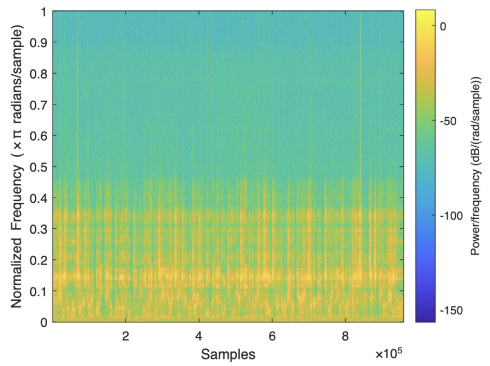

# DSP_Filter

### FIR and IIR filter application: remove noise
#### In the end, we discovered that IIR has much better performance than FIR, if both are at the same order. IIR has both zeros and poles to use and it could achieve more given the same order, but FIR also has advantage when it comes to phase shift.

-------
#### Noise audio spectrum

-------
FIR design and effect
 

------
IIR  

